# AI Engineer RoadMap

```mermaid
flowchart TD

A0["Phase 0: Python + Math Foundation"]
A1["NumPy / pandas / vectors / probability intuition"]
A2["Mini project: embedding similarity search"]

B0["Phase 1: AI + LLM Theory Core"]
B1["Tokens / embeddings / transformers / attention"]
B2["Prompting / hallucination / evaluation"]
B3["Explain concepts from memory checkpoint"]

C0["Phase 2: LLM API Engineering"]
C1["OpenAI SDK deep dive"]
C2["Structured outputs / tool calling"]
C3["Streaming / cost control / caching"]
C4["Project: production chatbot API"]

D0["Phase 3: RAG Systems - CRITICAL"]
D1["Chunking / embeddings / vector DB"]
D2["LlamaIndex + LangChain pipelines"]
D3["Hybrid search / reranking"]
D4["Project: PDF and Website knowledge assistant"]

E0["Phase 4: Agents and Workflows"]
E1["Tool design / function calling patterns"]
E2["Agent memory / planning loops"]
E3["Multi-step workflows"]
E4["Project: autonomous browser or automation agent"]

F0["Phase 5: Training and Fine-tuning Lite"]
F1["HuggingFace datasets / tokenizers"]
F2["LoRA fine-tuning small models"]
F3["Evaluation and overfitting control"]
F4["Project: fine-tuned domain model"]

G0["Phase 6: Deployment and MLOps"]
G1["Docker + FastAPI inference server"]
G2["GPU serving"]
G3["AWS or GCP deploy + CI/CD"]
G4["Monitoring / logging / cost tracking"]
G5["Project: public AI API SaaS"]

H0["Phase 7: Portfolio and System Design"]
H1["3 polished products"]
H2["Architecture diagrams"]
H3["GitHub + blog posts"]

I0["Phase 8: Interview Prep"]
I1["ML basics Q and A"]
I2["System design"]
I3["Coding + take-home practice"]

A0 --> A1 --> A2 --> B0 --> B1 --> B2 --> B3 --> C0 --> C1 --> C2 --> C3 --> C4 --> D0 --> D1 --> D2 --> D3 --> D4 --> E0 --> E1 --> E2 --> E3 --> E4 --> F0 --> F1 --> F2 --> F3 --> F4 --> G0 --> G1 --> G2 --> G3 --> G4 --> G5 --> H0 --> H1 --> H2 --> H3 --> I0 --> I1 --> I2 --> I3
```

**Description:**  
A phased learning path for AI engineers: from Python and math foundations through LLM theory, API engineering, RAG, agents, fine-tuning, deployment, portfolio, and interview prep.

**Key ideas:** Linear progression across 9 phases; each phase ends with a mini-project or checkpoint; emphasis on production, LLMs, and job readiness.

## Checklist

### Phase 0: Python + Math Foundation
- [x] NumPy / pandas / vectors / probability intuition
- [ ] Mini project: embedding similarity search

### Phase 1: AI + LLM Theory Core
- [ ] Tokens / embeddings / transformers / attention
- [ ] Prompting / hallucination / evaluation
- [ ] Explain concepts from memory checkpoint

### Phase 2: LLM API Engineering
- [ ] OpenAI SDK deep dive
- [ ] Structured outputs / tool calling
- [ ] Streaming / cost control / caching
- [ ] Project: production chatbot API

### Phase 3: RAG Systems (CRITICAL)
- [ ] Chunking / embeddings / vector DB
- [ ] LlamaIndex + LangChain pipelines
- [ ] Hybrid search / reranking
- [ ] Project: PDF and Website knowledge assistant

### Phase 4: Agents and Workflows
- [ ] Tool design / function calling patterns
- [ ] Agent memory / planning loops
- [ ] Multi-step workflows
- [ ] Project: autonomous browser or automation agent

### Phase 5: Training and Fine-tuning Lite
- [ ] HuggingFace datasets / tokenizers
- [ ] LoRA fine-tuning small models
- [ ] Evaluation and overfitting control
- [ ] Project: fine-tuned domain model

### Phase 6: Deployment and MLOps
- [ ] Docker + FastAPI inference server
- [ ] GPU serving
- [ ] AWS or GCP deploy + CI/CD
- [ ] Monitoring / logging / cost tracking
- [ ] Project: public AI API SaaS

### Phase 7: Portfolio and System Design
- [ ] 3 polished products
- [ ] Architecture diagrams
- [ ] GitHub + blog posts

### Phase 8: Interview Prep
- [ ] ML basics Q and A
- [ ] System design
- [ ] Coding + take-home practice

---

Got it — instead of a roadmap or checklist, you want something deeper:

👉 **a complete, structured “self-study book” you can follow like a textbook**
So you can literally read → implement → master → move to next chapter.

Below is your custom book:

**“Practical AI Engineer — From Zero to Production Agents”**

Written specifically for:

* software engineers
* low math preference
* fast job-ready
* production/LLM/agent focus

This is **not academic ML**.
This is **industry AI engineering**.

---

# 📘 Practical AI Engineer

## From APIs to Production Agents

---

# How to use this book

Each chapter:

* 🎯 Goal
* 🧠 Concepts (minimal theory)
* 🛠 Skills to learn
* 💻 Build tasks
* ✅ Checkpoint test

Rule:
**Don’t move forward until checkpoint passes.**

Time:
~5–6 months @ 3h/day

---

# Chapter 1 — Python for Machine Thinking

## 🎯 Goal

Become comfortable manipulating vectors and data like ML systems do.

## 🧠 Concepts

* arrays vs lists
* vectors
* dot product
* cosine similarity
* mean/std
* why embeddings are vectors

No calculus.

## 🛠 Skills

* NumPy
* pandas
* plotting

## 💻 Build

1. load CSV
2. compute similarity between sentences
3. write your own mini search engine using embeddings from OpenAI

## ✅ Checkpoint

You can implement cosine similarity **without looking it up**.

---

# Chapter 2 — How LLMs Actually Work (No Math)

## 🎯 Goal

Understand enough theory to reason about failures.

## 🧠 Concepts

* tokens
* embeddings
* transformer idea
* attention (intuitively)
* temperature
* hallucination
* fine-tuning vs RAG vs prompting

## 🛠 Skills

* token counting
* prompt experiments
* parameter tuning

## 💻 Build

* experiment notebook: same prompt with different temperature/top-p
* show hallucination cases

## ✅ Checkpoint

Explain entire LLM pipeline on whiteboard in 5 minutes.

---

# Chapter 3 — LLM API Engineering

## 🎯 Goal

Ship reliable AI features, not demos.

## 🧠 Concepts

* prompts as programs
* structured outputs
* tool/function calling
* retries
* evaluation
* cost control

## 🛠 Skills

Using:

* OpenAI SDK
* logging
* caching
* streaming

## 💻 Build

Production chatbot API:

* FastAPI
* streaming
* retry logic
* logs
* cost tracking

## ✅ Checkpoint

System runs 100 requests without crashing.

---

# Chapter 4 — Embeddings & Search

## 🎯 Goal

Understand semantic search deeply.

## 🧠 Concepts

* chunking
* embedding models
* vector DB
* similarity metrics
* reranking

## 🛠 Skills

* FAISS/Chroma
* embedding pipelines

## 💻 Build

* semantic search engine
* local knowledge base search

## ✅ Checkpoint

Top results are actually relevant.

---

# Chapter 5 — RAG Systems (Most Important)

## 🎯 Goal

Build knowledge assistants (most common AI job task).

## 🧠 Concepts

* retrieval pipeline
* context injection
* citation
* evaluation
* hybrid search

## 🛠 Skills

Using:

* LlamaIndex
* LangChain

## 💻 Build

1. PDF QA app
2. website crawler assistant
3. internal docs bot

## ✅ Checkpoint

You can rebuild RAG **from scratch without tutorial**.

---

# Chapter 6 — Agents & Tool Use

## 🎯 Goal

Create autonomous AI workflows.

## 🧠 Concepts

* tools
* planning loops
* memory
* multi-step reasoning
* task decomposition

## 🛠 Skills

* tool design
* browser automation
* workflows

## 💻 Build

* research agent
* auto blog writer
* form-filling browser bot

## ✅ Checkpoint

Agent completes multi-step task alone.

---

# Chapter 7 — Model Training Lite

## 🎯 Goal

Understand training enough to choose when it’s useful.

## 🧠 Concepts

* datasets
* tokenizers
* overfitting
* LoRA
* evaluation

Avoid large-scale training.

## 🛠 Skills

Using:

* Hugging Face

## 💻 Build

* fine-tune small 1–3B model
* domain FAQ assistant

## ✅ Checkpoint

You know when NOT to fine-tune.

---

# Chapter 8 — Deployment & MLOps

## 🎯 Goal

Become production engineer (huge hiring advantage)

## 🧠 Concepts

* containers
* inference servers
* GPUs
* monitoring
* scaling

## 🛠 Skills

* Docker
* FastAPI serving
* cloud deploy to Amazon Web Services or Google Cloud

## 💻 Build

Public AI API:

* dockerized
* cloud hosted
* logging
* rate limiting

## ✅ Checkpoint

Live public URL with users.

---

# Chapter 9 — Portfolio Engineering

## 🎯 Goal

Prove skill to recruiters fast.

Create only 3 projects:

1. RAG SaaS
2. Agent automation tool
3. Fine-tuned custom assistant

Each includes:

* README
* diagram
* demo video
* deploy link

---

# Chapter 10 — Interview Readiness

## Must answer:

* explain embeddings simply
* design RAG architecture
* when to fine-tune?
* how to reduce hallucination?
* deploy LLM at scale?
* cost optimization?

Practice:

* 1 small build every week
* system design questions
* mock interviews

---

# Final Result

After finishing the book you will be able to:

- ✅ build AI apps end-to-end
- ✅ design RAG
- ✅ build agents
- ✅ fine-tune small models
- ✅ deploy cloud inference
- ✅ pass AI engineer interviews

This matches exactly what modern AI application/agent engineers do.

