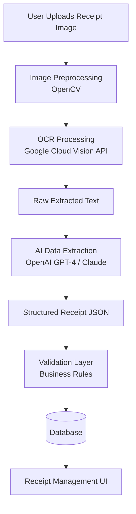

# Receipt OCR & AI Extraction System Architecture

**Description:**  
This system processes uploaded receipt images and automatically extracts structured data such as store name, date, total amount, tax, and purchased items. Because receipt formats vary widely, the system combines OCR technology with AI-based language models to interpret the text and convert it into structured JSON data.

